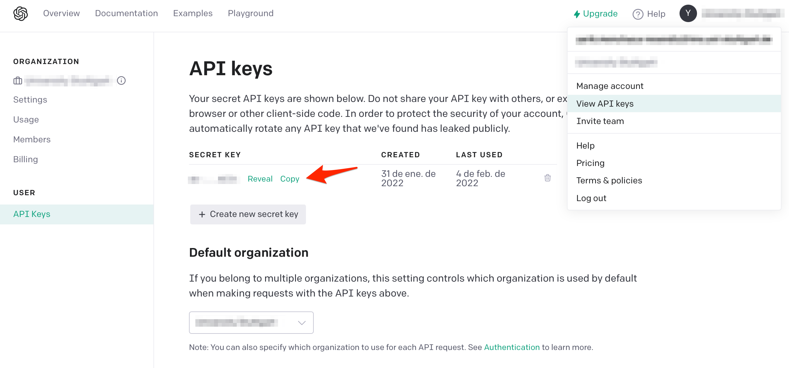

# A GPT-3 Text Classifier for Everyone

In this article, I’ll show you how to use the Generative Pre-trained Transformer 3 (GPT-3) from OpenAI to build your text classifier in just a few lines of code.

### What is GPT3 and why we can only use an API?

GPT-3 is an autoregressive language model, created by OpenAI, that uses machine learning (Deep leering) algorithms to produce human-like text. The full version, with 75 billion parameters, produces high-quality text that can be difficult to determine wheatear or not it was written by humans (which has both risks and bene

On September 22, 2020, Microsoft announced that it had licensed “exclusive” use of GPT-3 (only Microsoft has access to GPT-3’s underlying model), therefore, GPT-3 is a big black box that can only be accessed through the endpoint (API).




### GPT 3 text classifier

To have access to GPT3 you need to create an account in Opena.ai. The first time you will receive 18 USD to test the models and no credit card is needed. After creating the account, you can find the API KEYS under the option “API Keys” on the left menu.

### Data pre-processing.

GPT3 API expects as training data a Jsonline (Jsonl) file, consisting of a single training example with “text” and “label” fields no bigger than 150 MB.

{"text": "Me n him so funny...", "label": "ham"}
{"text": "i want to grasp your pretty booty :)", "label": "ham"}
{"text": "Sorry, I'll call later", "label": "ham"}

For this tutorial. you will build a Spam classifier using the Spam text dataset from Kaggle, which is a collection of 5157 with 13% spam. The following will pre-process the dataset to create the Jsonl file requested by GPT3’s API.


```python
from sklearn.model_selection import train_test_split
import pandas as pd
import json

def create_jsonl (dataset: pd.DataFrame, file_name: str):
    with open(f'{file_name}.jsonl', 'w') as file:
        for row in dataset.itertuples():
            file.write(json.dumps({"text": row.Message,
                                   'label': row.Category})+'\n')
    file.close()

raw_data = pd.read_csv('SPAM text message 20170820 - Data.csv')
train_raw, test_raw = train_test_split(raw_data, test_size=0.1)

create_jsonl(train_raw, 'train')
```


```python
#! pip install openai # to install OpenAI API
import openai

# set credentials
secrete_key = 'YOUR_SECRETE_KEY'
openai.api_key = secrete_key

# Upload file
openai.File.create(file=open("train.jsonl"), purpose="classifications")
```


```python
file_id = "YOU_FILE_ID"
```

# Classification Query


```python
import time

def request_classification (texts: iter, api_file: str) -> list:
    classes = list()
    i = 0
    while i < len(texts):
        try:
            print(f'computing: {i} of {len(texts)-1}', end="\r")
            query = openai.Classification.create(
                file=api_file,
                query=texts[i],
                search_model="text-curie-001",
                model="text-curie-001")
            classes.append(query['label'])
            i += 1
        except KeyboardInterrupt:
            break
        except Exception as e:
            print(f'error {e} in doc {i}')
            time.sleep(60)
    return classes
```


```python
predictions = request_classification(test_raw['Message'].to_list(),file_id)
```

That’s all I have for today! I hope this post is useful to build your classifier with GPT-3.
# Post-GPT3-API
# Post-GPT3-API
